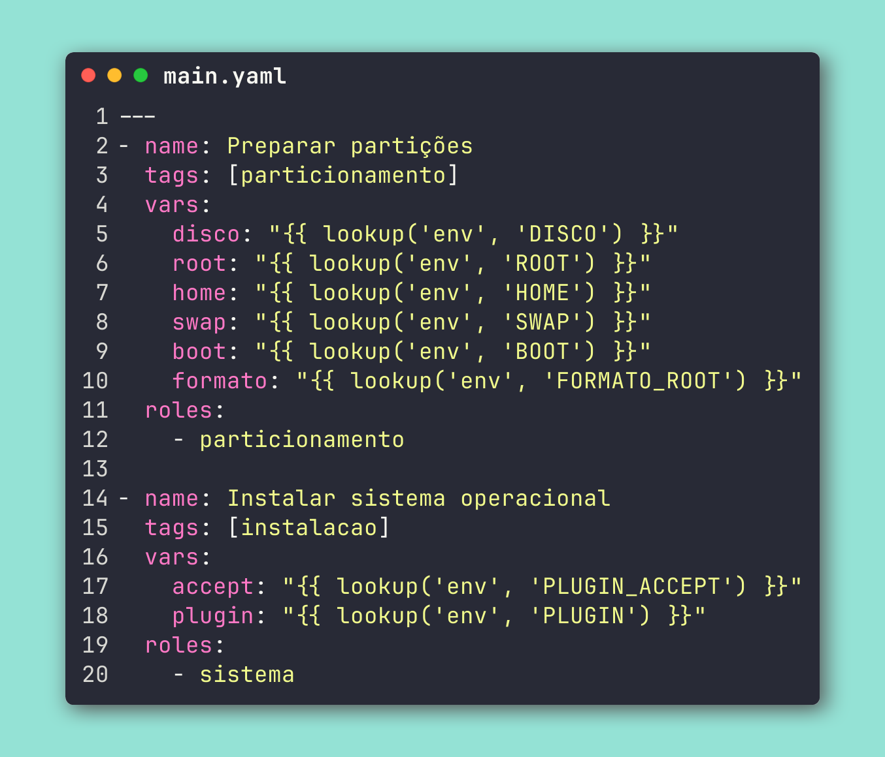

# Para escrever uma role [IMPORTANT]
1. Considere a playbook principal:

2. você deve criar uma pasta dentro de 'roles' com o nome do que você quer fazer, como 'particionamento', 'plugins' ou coisas do tipo.

3. crie um diretório 'tasks' dentro da pasta que você criou.

4. crie um arquivo 'main.yml' dentro do diretório 'tasks'.

5. escreva seu código dentro do 'main.yml'.

6. chame essa role dentro de main.yaml dentro da root do repo dentro de uma área separada, tenha certeza de criar uma tag e usar o nome do diretório de roles na área de roles.

7. crie um arquivo shell script dentro da pasta 'scripts' que explique exatamente o que essa task está fazendo com echos e chame e chame a task usando "ansible-playbook ./main.yaml --tags (sua tag)"
